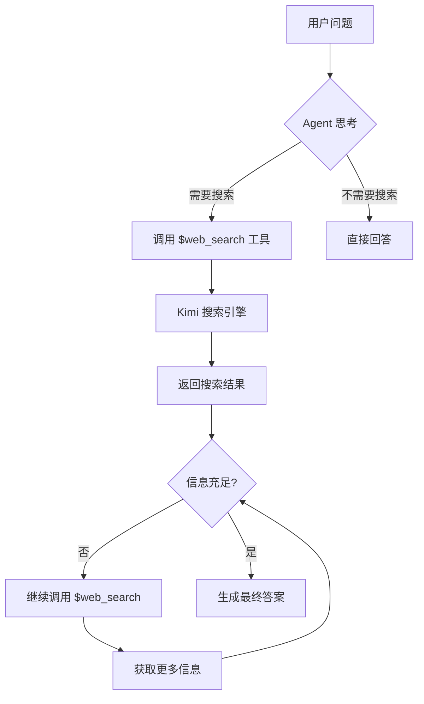

# Kimi Web Search Agent 🔍

一个基于 Kimi API 的智能搜索 Agent，能够理解用户问题，自动进行网络搜索并总结答案。

## 📋 项目概述

本项目实现了一个自主式 AI Agent，利用 Kimi（Moonshot AI）的内置 Web 搜索工具（search 和 crawl），能够：

- 🤔 **智能理解**：分析用户问题，识别关键信息需求
- 🔍 **自动搜索**：使用 Kimi 的内置 $web_search 工具获取实时网络信息
- 🔄 **迭代搜索**：可以多次调用搜索工具获取更全面的信息
- 📝 **智能总结**：综合多源信息，生成准确、全面的答案

## 🏗️ 架构设计



## 🚀 快速开始

### 1. 安装依赖

```bash
pip install -r requirements.txt
```

### 2. 配置 API Key

从 [Moonshot AI 平台](https://platform.moonshot.ai/) 获取 API Key，然后设置环境变量：

```bash
export MOONSHOT_API_KEY='your-api-key-here'
```

或创建 `.env` 文件：

```env
MOONSHOT_API_KEY=your-api-key-here
```

**注意**: 为了向后兼容，系统也支持使用 `KIMI_API_KEY` 环境变量。

### 3. 运行 Agent

**快速体验**（引导式交互）：
```bash
python quickstart.py
```

**交互模式**（持续对话）：
```bash
python main.py
```

**单次问答**：
```bash
python main.py "2024年诺贝尔物理学奖获得者是谁？"
```

**高级示例**：
```bash
python examples.py
```

## 📖 使用示例

### 基础使用

```python
from agent import WebSearchAgent
from config import Config

# 创建 Agent
agent = WebSearchAgent(api_key=Config.get_api_key())

# 提问并获取答案
question = "Python 3.12 有哪些新特性？"
answer = agent.search_and_answer(question)
print(answer)
```

### 高级功能

运行高级示例：

```bash
python examples.py
```

包含以下功能：
- 📦 **批量搜索**：同时搜索多个问题
- 🎯 **带上下文搜索**：提供背景信息进行更精准的搜索
- ⚖️ **比较搜索**：搜索并比较多个项目
- ✅ **事实核查**：验证陈述的真实性
- 📚 **研究助手**：深度研究某个主题

## 🛠️ 核心组件

### `agent.py` - 核心 Agent 实现
- `WebSearchAgent`: 主要的 Agent 类
- `search_and_answer()`: 执行搜索并生成答案的主方法
- `_chat()`: 与 Kimi API 进行对话交互
- `_get_system_prompt()`: 获取系统提示，定义 Agent 行为
- `_get_tools()`: 定义可用的工具（$web_search）
- `search_impl()`: 搜索实现的抽象层，便于扩展

### `config.py` - 配置管理
- API 配置
- 模型选择
- 搜索参数设置

### `main.py` - 主程序入口
- `run_interactive_mode()`: 交互式对话模式
- `run_single_question()`: 单次问答模式
- 命令行参数处理
- 会话管理

### `quickstart.py` - 快速体验脚本
- `demo_search()`: 演示搜索功能
- `interactive_mode()`: 简化的交互模式
- 彩色输出和用户引导
- API Key 配置检查

### `examples.py` - 高级示例
- `AdvancedWebSearchAgent`: 扩展功能的 Agent 类
- `batch_search()`: 批量处理多个问题
- `search_with_context()`: 带上下文的搜索
- `comparative_search()`: 比较多个项目
- `fact_check()`: 事实验证功能
- `example_research_assistant()`: 深度研究示例

## 🔧 配置选项

| 配置项 | 说明 | 默认值 |
|--------|------|--------|
| `MOONSHOT_API_KEY` | Moonshot AI API 密钥 | 必填 |
| `KIMI_API_KEY` | 旧版 API 密钥变量名（向后兼容） | 可选 |
| `KIMI_BASE_URL` | API 基础 URL | `https://api.moonshot.cn/v1` |
| `DEFAULT_MODEL` | 默认模型 | `kimi-k2-0905-preview` |
| `MAX_SEARCH_ITERATIONS` | 最大搜索迭代次数（Config 中设置） | 3 |
| `SEARCH_TIMEOUT` | 搜索超时时间（秒） | 30 |
| `temperature` | 控制生成内容的创造性 | 0.6 |

## 📊 技术特点

### 核心技术
- **Kimi API**: 使用 Moonshot AI 的最新 K2 模型（kimi-k2-0905-preview）
- **内置工具调用**: 利用 Kimi 的 `$web_search` 内置函数
- **迭代式搜索**: 支持多轮搜索直到获得充分信息（最多5次迭代）
- **上下文管理**: 维护完整对话历史，支持连续对话
- **温度控制**: 支持调整生成内容的创造性（temperature 参数）

### 优势
- ✅ **实时信息**: 获取最新的网络信息
- ✅ **智能理解**: 理解用户意图，精准搜索
- ✅ **结构化输出**: 生成组织良好的答案
- ✅ **可扩展性**: 易于添加新功能和工具

## 📝 开发计划

- [ ] 添加异步搜索支持（使用 aiohttp）
- [ ] 实现搜索结果缓存机制
- [ ] 支持更多搜索后端（通过 search_impl 扩展）
- [ ] 支持多语言搜索
- [ ] 添加搜索结果质量评分
- [ ] 实现搜索历史记录
- [ ] 集成重试机制（使用 tenacity）
- [ ] 优化长对话的上下文管理

## 📄 许可证

MIT License

## 🔗 相关链接

- [Kimi API 文档](https://platform.moonshot.ai/docs)
- [Web 搜索工具文档](https://platform.moonshot.ai/docs/guide/use-web-search)
- [Moonshot AI 平台](https://platform.moonshot.ai/)

## ⚠️ 注意事项

1. **API 限制**: 请注意 Kimi API 的调用限制和配额
2. **搜索质量**: 搜索结果质量依赖于 Kimi 的搜索能力
3. **响应时间**: 网络搜索可能需要一定时间，请耐心等待
4. **内容准确性**: Agent 会尽力提供准确信息，但建议对重要信息进行二次验证

## 💡 使用建议

1. **明确问题**: 提供清晰、具体的问题以获得更好的答案
2. **提供上下文**: 必要时提供背景信息帮助 Agent 理解
3. **迭代优化**: 如果答案不满意，可以提供更多细节重新提问
4. **合理期望**: Agent 基于搜索结果回答，可能无法回答所有问题

---

**作者**: AI Agent 实战训练营  
**版本**: 1.0.0  
**更新时间**: 2024
